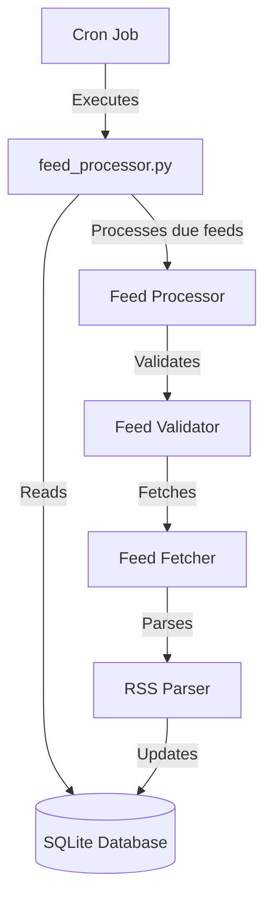

# RSS Feed Aggregator - System Design

## System Overview
The RSS Feed Aggregator is a scheduled process that fetches RSS feeds from various sources, parses their content, and stores the posts in a SQLite database. The system is designed to run periodically via a cron job, checking for feeds that are due for updates based on their individual update intervals.

## Architecture



## Database Schema

```sql
CREATE TABLE feeds (
    id INTEGER PRIMARY KEY,
    url TEXT NOT NULL,
    name TEXT,
    update_interval INTEGER DEFAULT 60, -- Minutes between updates
    last_fetched TIMESTAMP,
    fetch_status INTEGER DEFAULT 0,     -- 0=success, 1=error
    error_message TEXT,
    error_count INTEGER DEFAULT 0,
    last_error TIMESTAMP,
    active INTEGER DEFAULT 1,           -- Boolean: 1=active, 0=inactive
    created_at TIMESTAMP DEFAULT CURRENT_TIMESTAMP,
    updated_at TIMESTAMP DEFAULT CURRENT_TIMESTAMP
);

CREATE TABLE posts (
    id INTEGER PRIMARY KEY,
    feed_id INTEGER,
    title TEXT,
    link TEXT,
    guid TEXT UNIQUE,
    description TEXT,
    published_date TIMESTAMP,
    created_at TIMESTAMP DEFAULT CURRENT_TIMESTAMP,
    FOREIGN KEY (feed_id) REFERENCES feeds(id)
);

-- Indexes for performance
CREATE INDEX idx_posts_feed_id ON posts(feed_id);
CREATE INDEX idx_posts_guid ON posts(guid);
CREATE INDEX idx_feeds_last_fetched ON feeds(last_fetched);
```

## Core Components

### Database Handler
- Manages connections to the SQLite database
- Provides methods for CRUD operations on feeds and posts
- Handles transaction management and error recovery

### Feed Validator
- Validates feed URLs before fetching
- Checks for proper RSS/Atom format
- Verifies feed accessibility

### Feed Fetcher
- Retrieves RSS content from URLs
- Implements timeout handling
- Uses proper HTTP headers
- Handles network errors gracefully

### RSS Parser
- Parses RSS/Atom XML content
- Extracts relevant post data (title, link, description, etc.)
- Handles different feed formats and edge cases

## Scheduling Mechanism
The system uses a simple cron-based approach:

1. A cron job runs the main processor script at regular intervals (e.g., every 15 minutes)
2. The script determines which feeds are due for processing based on:
   - Last fetch time
   - Feed-specific update interval
   - Error status (implementing backoff for problematic feeds)
3. Only feeds that are due are processed in each run

Example cron configuration:
```
*/15 * * * * /usr/bin/python3 /path/to/rss-summarizer/feed_processor.py >> /path/to/rss-summarizer/logs/processor.log 2>&1
```

## Error Handling Strategy

### Feed-Level Error Handling
- Records detailed error information in the database
- Implements exponential backoff for problematic feeds
- Tracks consecutive failures
- Can automatically deactivate feeds after X consecutive failures

### System-Level Error Handling
- Comprehensive logging of all operations
- Graceful handling of database connection issues
- Proper exception handling throughout the codebase

## Future Enhancements
- Web interface for feed management
- Content filtering and categorization
- Full-text search capabilities
- Feed statistics and analytics
- Email notifications for new posts
- Content summarization using AI
